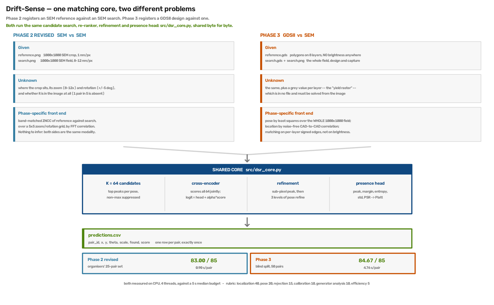

# Drift-Sense — Grand Finale

Two submissions, one matching core.

**Phase 2** registers an SEM reference against an SEM search image.
**Phase 3** registers a GDSII design against one. Both report the same thing: where the
reference is, at what zoom and rotation, whether it is there at all, and how confident we
are.



| | scored on | result | per pair | weights |
|---|---|---|---|---|
| [`phase_2/`](phase_2/) | the organisers' 25-pair set | **83.00 / 85** | 0.90 s | trained, shipped |
| [`phase_3/`](phase_3/) | 50-pair blind split | **84.67 / 85** | 4.76 s | none — classical |

Both run on CPU with no network, well inside the 5 s median budget and the 20 s hard
timeout. The 85 is what a local run can compute: localization 40, pose 20, rejection 15,
calibration 10. The other 15 — generator analysis 10, efficiency 5 — belong to the jury,
and efficiency is ranked against other entrants rather than scored absolutely.

---

## Run either one

```bash
cd phase_2   &&  python -m pip install -r requirements.txt
python register.py --input <dataset>/pairs.csv --output predictions.csv
python score.py  --truth <dataset>/ground_truth.csv --pred predictions.csv
```

```bash
cd phase_3   &&  python -m pip install -r requirements.txt
python phase3.py --input <dataset>/pairs.csv --output predictions.csv
python score.py  --truth <dataset>/ground_truth.csv --pred predictions.csv
```

Paths inside `pairs.csv` resolve relative to the directory holding it. Phase 3 needs
`gdstk` to read the design files; Phase 2 does not.

## What the two problems share

`src/dsr_core.py` is the same file in both packages, byte for byte. It owns everything
after the phase-specific front end:

- **K = 64 candidates** — the top peaks per pose, non-maximum suppressed
- **a cross-encoder** that scores all 64 jointly, with `logit = head(e) + α·classical_score`
  and the head zero-initialised, so a trained model is a *correction* to the classical
  ranking rather than a replacement for it
- **refinement** — sub-pixel peak interpolation, then three levels of pose refinement
- **a presence head** over pose-surface statistics (peak, margin, entropy, std, PSR),
  Platt-calibrated with an F1-optimal threshold stored in the checkpoint

## Where they differ

**Phase 2** has two SEM images and nothing to infer: correlate the reference against the
search over a 5×5 zoom/rotation grid, as band-matched ZNCC in the Fourier domain.

**Phase 3** has a design file with no brightness anywhere in it, and that changes the shape
of the problem. `search.gds` covers the whole search image, so the pose becomes a
least-squares fit over all 1,000,000 pixels rather than a patch match, and the location
becomes a noise-free search between two designs. The per-layer greys are solved from the
image at every candidate pose — and then used for the **confidence score**, never for the
match, because a brightness fit you had to guess at is exactly the wrong thing to register
on. Registration runs on per-layer signed edges instead.

Each package has a `method.png` walking through its pipeline on a real pair, with every
panel a genuine intermediate rather than an illustration.

## Tested on data it never saw

After submission, both packages were run from a fresh clone of this repo, installed from its
own `requirements.txt` into a clean environment, on sets from seeds never used before —
including sets made by **the organisers' own `drift-sense-i4c` generator**.

| fresh set | pairs | as submitted | **now** |
|---|---|---|---|
| Phase 2 — the generator behind the organisers' 25-pair set | 47 | 83.81 | 83.81 |
| Phase 3 — our generator | 40 | 84.00 | **84.51** |
| Phase 3 — **i4c, rotation 0°** | 32 | 72.09 | **85.00** |
| Phase 3 — **i4c, rotation ±5°** | 32 | 63.76 | **85.00** |

The drop on the organisers' generator was entirely ours — assumptions tuned on our own data
— and bugs 4 and 5 below are the fixes. Every threshold was chosen on separate development
sets, never on these.

## Five bugs worth reading about

The first three were found by running real files through a real entry point; the last two
by testing a fresh clone on the organisers' own generator after submission.

- **The canvas size is not in the GDS.** The design polygons overflow the rendered canvas,
  so deriving the canvas from the polygon bounding box put the CAD→SEM mapping out by up to
  132 px in both axes. 11 of 48 pairs then picked a zoom 20–48% wrong. Deriving it from the
  candidate pose instead took Phase 3 from **68.39 to 84.12**. → `phase_3/METHODS.md`
- **The generator's label is not where the feature is visible**, by a half-pixel downsample
  convention in both axes and by scan drift it never corrects for. Worth ~8 of the 40
  localization points. → `phase_3/NOTES.md`
- **The coarse pose grid could never sample the organisers' pose.** It was offset by half a
  step, so it never hit zoom 10.0 or rotation 0.0 — exactly what their generator emits —
  and the true R² peak is narrower than the step. It locked onto an aliasing ridge from the
  periodic layout instead, and all 12 real pairs came out at the same wrong θ = ±0.415°. An
  aligned, finer grid with 5 restarts took pose from **16.00 to 20.00 / 20**.
  → `phase_3/METHODS.md`
- **We let the SEM overrule an exact geometry match.** Layouts repeat, and in a noisy image a
  93–97%-similar stretch looks the same as the real one, so ranking on the SEM picked a
  near-copy on 4 of 26 pairs even though the geometry had the truth first every time. The
  copy is now decided at 1 nm, where the true one matches the design exactly; presence uses
  the same match. → `phase_3/METHODS.md`
- **Our canvas convention was not theirs under rotation.** Ours grows the canvas with
  rotation; theirs does not, and with rotation on pose fell to 12.67 / 20. It is now chosen
  by fit. → `phase_3/METHODS.md`

## Layout

```
overview.png    the figure above
phase_2/        register.py, score.py, src/, weights/model_best.pt, results/
phase_3/        phase3.py,   score.py, src/, results/
```

Each package is self-contained: nothing outside its own directory, no build step, and
pinned dependencies. Together they are about 10 MB, most of it the Phase 2 checkpoint and
the figures.

## Honest gaps

- **Phase 3 is untrained.** Its numbers are the classical pipeline, which is deterministic
  by construction — the zero-init head makes the ranking exactly the classical score, and
  six random seeds give the same answer to the pixel.
- **`pairs.csv` is assumed to sit at the dataset root** in both entry points.
- **Phase 3 now takes 4.6–4.8 s per pair** — inside the 5 s median budget, with little room.
- **Rejection rests on few absent pairs** — 5 in the Phase 2 real set, 16 across the Phase 3
  sets. Perfect F1 there is encouraging, not established.
- **Three questions for the organisers** about the Phase 3 blind set, none answerable from
  the code they published. → `phase_3/NOTES.md`
