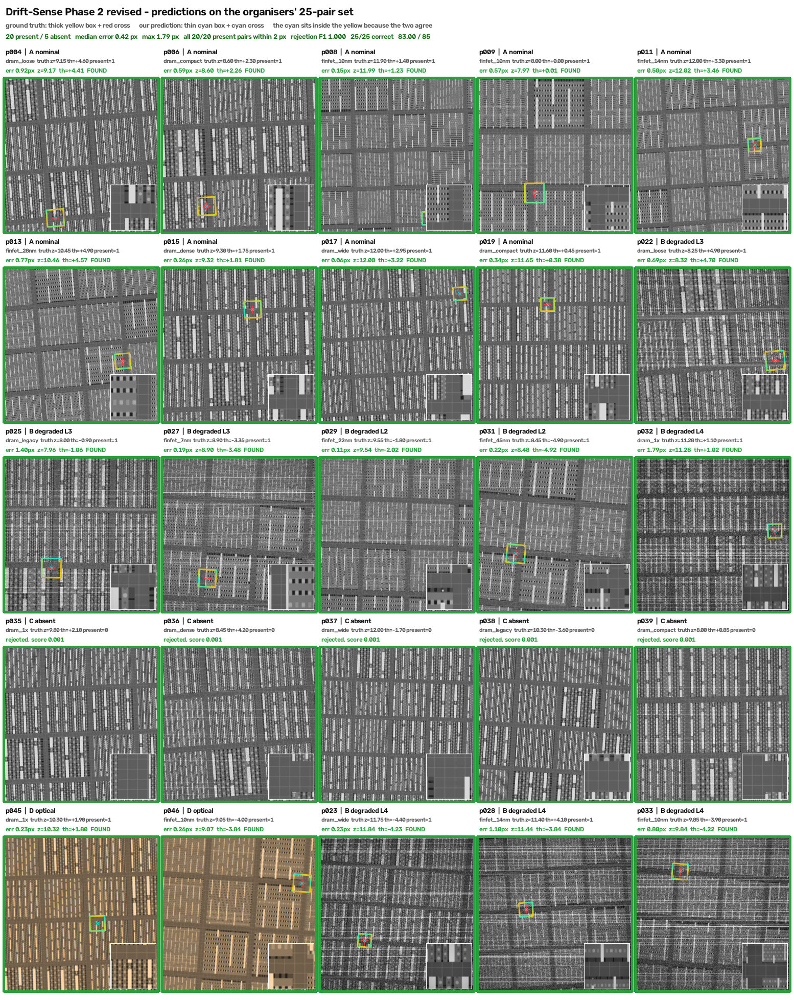

# Drift-Sense Phase 2

Register an SEM reference against a noisy SEM search image: report its centre, pose, a
found flag and a confidence score.

```bash
python -m pip install -r requirements.txt
python register.py --input <dataset>/pairs.csv --output predictions.csv
python score.py --truth <dataset>/ground_truth.csv --pred predictions.csv
```

Paths inside `pairs.csv` are resolved relative to the directory holding it. CPU only, no
network, no GPU. The trained checkpoint ships in `weights/`.

---

## Measured

| set | pairs | total /85 | localization /40 | pose /20 | rejection /15 | calibration /10 | s/pair |
|---|---|---|---|---|---|---|---|
| **organisers' 25-pair set** | 25 (20 present) | **83.00** | 38.80 · 17/20 ≤1 px | 19.20 | **15.00** | **10.00** | 0.95 |
| held-out generated | 120 (89 present) | 80.32 | 37.12 · 63/89 ≤1 px | 18.60 | 14.64 | 9.94 | 0.86 |

Every present pair in the 25-pair set is inside **2 px**, rejection and calibration are
both perfect there, and the worst pair is 1.79 px.

Efficiency: **0.86–0.95 s median**, 1.06 s worst, against a 5 s median budget and a 20 s
hard timeout, on 4 CPU threads.

## How it works


Every panel in `method.png` is a real intermediate of the shipped model on one of the
organisers' pairs — the two SEM images, the size of the problem (the reference is ~83 px of
a 1000 px field), the ZNCC surface at the winning pose, the 64 candidates the search
actually proposed, and the prediction against the truth.

Both sides are SEM images, so unlike Phase 3 there is no design file and nothing to infer
about per-layer brightness. What makes it hard instead is **scan drift**: each row of the
search is warped by a different amount, so the two images are never a rigid translation of
one another and a plain correlation peak is not enough.

1. **Candidate search.** Band-matched ZNCC of the reference against the search over a 5×5
   zoom/rotation grid, by FFT correlation. The top K=64 peaks survive non-maximum
   suppression.
2. **Re-ranking.** A cross-encoder scores all 64 jointly. Its logit is
   `head(e) + α·classical_score` with the head zero-initialised, so training learns a
   correction to the classical ranking rather than replacing it.
3. **Refinement.** Sub-pixel peak interpolation, then three levels over translation, zoom
   and rotation.
4. **Presence.** A head over the pose-surface statistics — peak, margin, entropy, std, PSR
   — Platt-calibrated with an F1-optimal threshold, both saved in the checkpoint.

Measured: training was worth **+0.9 localization and +0.6 pose** on held-out data. Its real
contribution is rejection, which an uncalibrated head cannot do at all. `METHODS.md` has
the sweeps behind every setting.

## Every pair, at a glance



`results_25pair_sheet.png` — all 25 pairs with the ground truth (thick yellow box, red
cross) and our prediction (thin cyan box, cyan cross) drawn on the same search image. The
cyan sits inside the yellow on every present pair, which is what a median error of 0.42 px
looks like. Each tile carries its architecture, the true zoom and rotation, and our error,
recovered pose and found flag. Green frames mark the pairs handled correctly — **25 of 25**,
including all five absent sites, each rejected with score 0.001.

The bottom row is the interesting part: the two `D optical` pairs are 3-channel colour
captures rather than SEM greyscale, matched on luminance, at 0.23 and 0.26 px. The three
`B degraded L4` pairs next to them are the harshest noise level in the set and still land
inside 1.10 px.

## Which model, and why

Three variants were trained. All three were then put through the *same* two test sets —
the models' own validation sets are different draws and are not comparable to each other:

| variant | organisers' 25 | held-out 120 | pose (120) | F1 (120) | s/pair |
|---|---|---|---|---|---|
| **intensity** (shipped) | **83.00** | **80.32** | 0.930 | **0.976** | **0.86** |
| hybrid (intensity + edge) | 82.65 | 80.13 | 0.931 | 0.965 | 1.61 |
| edge (learned boundary) | 82.10 | 77.67 | 0.870 | 0.952 | 0.95 |

**Intensity wins on both sets and is the fastest.** On the 120-pair set it and the hybrid
are identical on localization (0.928) and pose (0.930 vs 0.931); the whole difference is
rejection — F1 0.976 vs 0.965. So the hybrid's second cue buys nothing on SEM-vs-SEM and
costs 1.9× the time, and the edge-only variant is clearly behind on pose (0.870).

Worth noting: the models' own validation ranked them the other way (hybrid 80.90 >
intensity 80.58 > edge 80.15). That ordering came from three different validation draws
and did not survive a common test set.

Also measured during training: the **learned boundary detector lost to classical
gradients** on validation in all three runs, so every checkpoint carries
`edge_choice='classical'`. The learned-vs-classical switch is what kept that from costing
anything.

## Layout

```
register.py       entry point
score.py          rubric scorer
src/dsr_core.py   candidate search, re-ranker, refinement, rubric
weights/          model_best.pt — the shipped intensity model (3.5 MB)
results/          the predictions behind the table above
method.png        the pipeline walked through on a real pair
results_25pair_sheet.png   all 25 pairs with truth and prediction drawn on each
METHODS.md        method and measurements
requirements.txt  three pinned dependencies
```

Two Python files plus the shared core. No generator, no vendored code, nothing to build.

## Known gaps

- **`pairs.csv` is assumed to sit at the dataset root.** Paths resolve against its own
  directory; a manifest stored elsewhere would need a `--root` flag.
- **The 25-pair set is 20 present and 5 absent**, so its perfect F1 and AUC are encouraging
  rather than established. The 120-pair set is the more honest rejection estimate
  (F1 0.976, AUC 0.994).
- **Localization is the weakest component**, at 17/20 within 1 px on the real set and 63/89
  on the generated one. Everything is inside 2 px on the real set, so this is sub-pixel
  precision rather than a matching failure.
