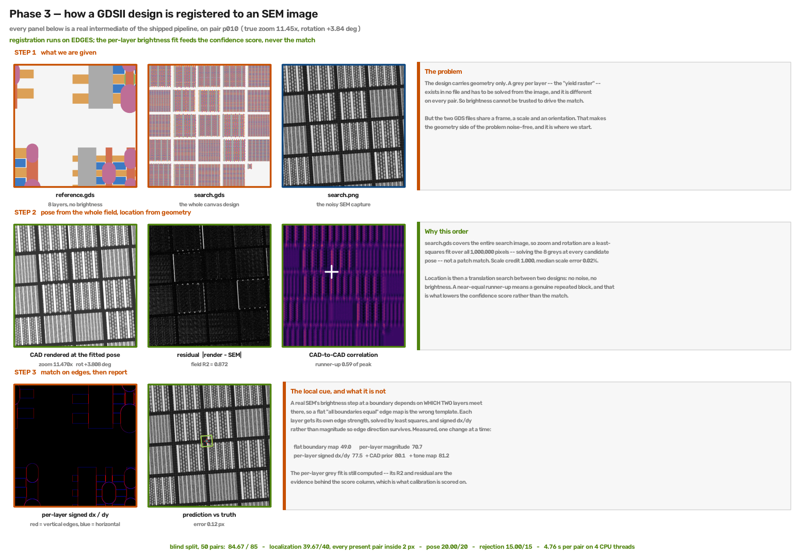

# Drift-Sense Phase 3

Register a GDSII design against a noisy SEM capture: report its centre, pose, a found flag
and a confidence score.

```bash
python -m pip install -r requirements.txt
python phase3.py --input <dataset>/pairs.csv --output predictions.csv
```

Paths inside `pairs.csv` are resolved relative to the directory holding it, as the spec
specifies. CPU only, no network, no GPU, no weights file needed.

To check a run against ground truth:

```bash
python score.py --truth <dataset>/ground_truth.csv --pred predictions.csv
```

---

## How it works



Every panel in `method.png` is a real intermediate of the shipped pipeline on one pair —
the two GDS files rasterised, the SEM capture, the whole-field fit and its residual, the
CAD-to-CAD correlation surface, the per-layer edge basis, and the prediction against the
truth. The three steps are:

1. **Pose from the whole field.** `search.gds` covers the entire search image, so zoom and
   rotation are a least-squares fit over all 1,000,000 pixels, solving the 8 per-layer greys
   at every candidate pose. The search starts from an aligned 0.25-zoom / 0.5° grid and
   descends from its 5 best cells, because the true R² peak is narrower than any coarser
   grid and a periodic layout creates a false ridge beside it. Because the two generators
   we know build their canvas differently under rotation, a cheap first pass picks the
   canvas convention that fits the image better. Pose credit **20.00 / 20** on every set,
   including the organisers' own generator with rotation on.
2. **Location from geometry, decided at 1 nm.** Both CADs share a frame, so finding the
   reference design inside the search design is noise-free — no SEM involved. The top
   matches are re-checked pixel for pixel at 1 nm: the true copy reproduces the reference
   **exactly**, while look-alike stretches of layout reach only 87–97%. When one match is
   exact, the answer is locked to it and the SEM only refines the position within it.
3. **Match on edges.** A per-layer *signed* dx/dy gradient fit. A flat "all boundaries
   equal" map is the wrong template, because a real SEM's step at a boundary depends on
   which two layers meet there. Per-layer fitting was worth +21.7 points over flat, and
   signed over magnitude a further +6.8.

Brightness never drives the match. The per-layer grey fit is computed — with no grey ever
assumed, the 8 levels and a background offset are unknowns recovered from the image.

**Presence is the 1 nm design match**: how much of the reference the search design
reproduces exactly at the best match. Present pairs score 0.9993–1.0000, absent ones at most
0.8981 on the development sets; the found threshold is 0.95.

`METHODS.md` has the measurements behind each step, including what was tried and rejected.

---

## Measured

| set | pairs | total /85 | localization /40 | pose /20 | rejection /15 | calibration /10 | s/pair |
|---|---|---|---|---|---|---|---|
| train split | 50 (48 present) | **85.00** | 40.00 · 48/48 ≤1 px | **20.00** | **15.00** | **10.00** | 4.67 |
| **blind split** | 50 | **84.67** | 39.67 · 46/48 ≤1 px | **20.00** | **15.00** | **10.00** | 4.76 |
| absent-heavy ¹ | 24 (14 absent) | **85.00** | **40.00** · 10/10 ≤1 px | **20.00** | **15.00** | **10.00** | 4.63 |

**The blind row is the real number** — the only one measured under the scored condition,
with `reference_sem_path` and `params_json_path` empty. The 0.33 point gap to the train
split is the scan-drift correction falling back to a nominal shear instead of reading the
pair's real one from `params.json`; two pairs cross the 1 px line, both in x.

¹ One of the development sets the presence threshold was chosen on, so its rejection score
is not independent. The other two rows were not used for any tuning.

Rejection is scored as F1 **on the found flag we output**, as the spec defines it.

### Tested on data it never saw — including the organisers' own generator

A fresh clone of this repo, a clean Python 3.12 install from `requirements.txt`, and four sets
from seeds never used before: our generator, and **the organisers' `drift-sense-i4c`
generator** with its rotation off (its default) and on.

| fresh set | pairs | as submitted | **now** | ≤1 px | pose /20 |
|---|---|---|---|---|---|
| our generator | 40 | 84.00 | **84.51** | 33/33 | 20.00 |
| **i4c, rotation 0°** | 32 | 72.09 | **85.00** | 26/26 | 20.00 |
| **i4c, rotation ±5°** | 32 | 63.76 | **85.00** | 24/24 | 20.00 |

The whole difference comes from two fixes described below — deciding the copy at 1 nm, and
choosing the canvas convention — and the presence score that came with the first.

Efficiency: **4.6–4.8 s median**, 5.95 s worst, against a 5 s median budget and a 20 s hard
timeout, on 4 CPU threads.

Reproduce any row: `python score.py --truth <set>/ground_truth.csv --pred results/<file>.csv`.

## These numbers are deterministic

The re-ranker's logit is `head(e) + alpha · classical_scores`, and `head`'s output layer is
zero-initialised. With no checkpoint present it contributes the same constant to every
candidate, so the ranking reduces **exactly** to the classical similarity score. Verified
directly: six different random seeds pick the same candidate and give the same answer to
the pixel. There is no seed dependence and no trained weight file — this is a classical
geometric method, with the network wired in as a learned correction that is currently
identity.

## Layout

```
phase3.py         entry point
score.py          rubric scorer
src/dsr_core.py   candidate search, re-ranker, refinement, rubric
src/p3_data.py    CAD geometry, global pose fit, load_pair
results/          the predictions behind the table above
method.png        the pipeline walked through on a real pair
weights/          optional model_best.pt; picked up automatically if dropped in
METHODS.md        method and measurements
NOTES.md          the ground-truth convention, and open questions for the organisers
requirements.txt  four pinned dependencies
```

Four Python files, ~2,000 lines, no package to install and nothing vendored.

## About the numbers

They were measured on two generated sets — 50 pairs at the spec's ~1-in-12 absent ratio,
and 24 pairs at 14 absent, because the first ratio gives too few absent sites to estimate a
rejection F1 from. Neither the sets nor the code that made them ship here; the predictions
they produced are in `results/` and `score.py` reproduces every number from them.

Both sets were deliberately harder than the stock i4c CAD path, which cannot vary either
pose axis (`SCALE_FACTOR` is pinned at 10, `search_rotation_deg` defaults to 0): zoom drawn
from [8, 12] and rotation from [-5, 5] degrees, search greys usually *not* the yield model
so brightness genuinely has to be inferred, and a uniqueness gate requiring the true pose's
image-wide peak to land on the label with no rival above 92%.

## Five bugs worth knowing about

The first three were found by running against real `.gds` files through a real entry point.
The last two were found after submission, by testing a fresh clone on the organisers' own
generator — the one test that exposes assumptions tuned on our own data.

1. **The canvas size is not in the GDS.** The design polygons overflow the rendered canvas,
   so taking the canvas size from the polygon bounding box put the CAD→SEM mapping out by
   up to 132 px in both axes. That collapsed the field fit and made 11 of 48 pairs pick a
   zoom 20–48% wrong. Deriving the canvas from the candidate pose instead took the set from
   **68.39 to 84.12**.
2. **The generator's label is not where the feature is visible** — by a +0.45 px half-pixel
   downsample convention in both axes, and by the scan drift it never corrects for (~0.75 px
   in x). Worth ~8 of the 40 localization points. `NOTES.md`.
3. **The coarse pose grid could never find the organisers' pose.** It ran
   `np.arange(7.75, 12.26, 0.5)` × `np.arange(-5.5, 5.51, 1.0)` — offset by half a step, so
   it never sampled zoom 10.0 or rotation 0.0, which is exactly what the i4c generator
   emits. The R² peak is also narrower than that step (half-width ±0.05 in zoom on i4c), so
   the search settled on an aliasing ridge from the periodic mat/strip pitch instead — R²
   0.23 against 0.85 at the truth — and **all 12 real pairs converged to the same wrong
   θ = ±0.415°**. Localization never showed it, because location comes from CAD-to-CAD
   geometry, not from the pose fit. An aligned, finer grid with 5 restarts fixed it:

   | | i4c pairs, θ ≤ 0.25° | our pairs, θ ≤ 0.25° | pose on i4c |
   |---|---|---|---|
   | before | **0 / 12** | 17 / 23 | 16.00 / 20 |
   | after | **12 / 12** | **23 / 23** | **20.00 / 20** |

   Blind split 83.62 → **84.20**, absent-heavy set 82.60 → **85.00**, for +0.55 s per pair.
   `METHODS.md §1`.
4. **We let the SEM overrule an exact geometry match.** The final pick was made on how well
   the SEM image matched, and in a noisy image a 93–97%-similar stretch of layout looks the
   same as the real one. On the organisers' generator that chose a near-copy on 4 of 26
   pairs, 54–77 px off, though the geometry had ranked the true copy first every time. The
   same blur made the old presence score reject 7 of 26 present pairs. Now the copy is
   decided at 1 nm, where the truth matches exactly. `METHODS.md §2, §5`.
5. **Our canvas convention was not theirs under rotation.** Ours grows the canvas with
   rotation; theirs does not. With rotation on, pose fell to 12.67 / 20. The convention is
   now chosen by fit. `METHODS.md §1`.

We also found our own scorer had graded rejection at the best threshold for each test set
rather than on the found flag. On every number published here the two agreed; the scorer
now uses the found flag.

## Known gaps

- **`pairs.csv` is assumed to sit at the dataset root.** Paths resolve against its own
  directory. A manifest stored elsewhere would need a `--root` flag.
- **An empty `search_gds_path` is untested.** The code falls back to a 25-pose grid; it
  should work but would run ~10 s/pair — inside the 20 s timeout, outside the budget.
- **Very repetitive layouts can still be flagged absent.** When many CAD matches tie at
  8 nm, the true copy can fall outside the three re-checked at 1 nm; the position is still
  right but presence misses it (1 of 33 present pairs on our fresh set). The fix — also
  checking the location actually answered — is known but not applied.
- **Time headroom is small.** Median 4.6–4.8 s, worst 5.95 s, against a 5 s *median*
  budget. Inside the rubric, but a slower judging machine eats into it.
- **Three open questions for the organisers**, none answerable from `drift-sense-i4c`:
  whether the blind set's scale really varies (that code cannot vary it), what rotation
  range it uses (its CLI can only emit 0°), and which generator produces it at all —
  neither the CLI nor the Streamlit export writes the manifest the spec describes.
  `NOTES.md`.
